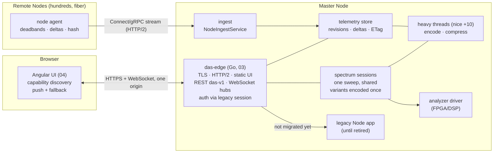
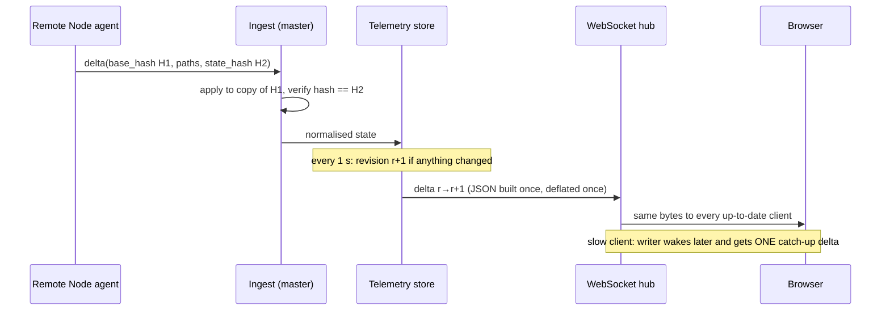
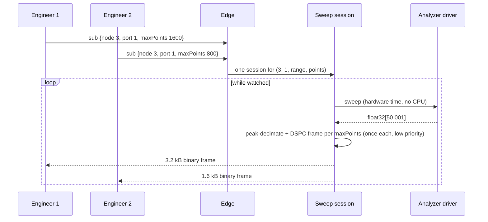

# Target architecture (LTS)

## Principles

1. **One origin, one contract.** The browser talks to one host and port. Every process
   behind it implements `das-v1`, and the conformance suite proves it.
2. **Work per change, not per request.** A sweep, a telemetry revision or a static file
   is encoded **once** per representation and shared by every client. Requests only
   look up and write bytes.
3. **Push what changed; poll only as a fallback.** Browsers get snapshot + deltas over
   WebSocket (binary frames for spectrum). Remote Nodes send deltas with a state hash.
   Polling clients get ETag/304 and `?since=` deltas.
4. **Priorities, not hope.** Request handling always beats heavy work: low-priority
   threads (03), separate processes with CPU weights (02) or low-priority workers (01).
   Everything has a limit.
5. **A busy server is not a dead server.** The heartbeat answers in milliseconds no
   matter what else runs, and reports `degraded` with the reason. The UI needs several
   consecutive misses before it says "offline".
6. **Evolve by strangling, not by rewriting.** New components go in front, take over one
   path at a time, and every step is reversible.

## Components

| Component | Responsibility | Must never |
|---|---|---|
| Edge (front door) | Serve the UI and API, authenticate (via legacy session), route, push | Block on data encoding; hold per-client queues |
| Telemetry store | Merge node states, detect real changes, publish revisions (1/s), keep 2 min of history | Treat noise or counters as changes |
| Spectrum sessions | One hardware sweep per analyzer configuration while someone watches; encode each representation once | Sweep per request; sweep when nobody watches |
| Heavy threads | Encoding and compression at low priority, bounded | Run on the request path |
| Ingest | Verify and apply node deltas, request resync on divergence | Apply a delta it cannot verify |
| Node agent | Report by exception, keep-alives, full state on resync | Send unchanged state |

## Data flows

### Telemetry (Remote Node → engineer)

### Spectrum (engineer → hardware → engineer)

## Service levels (proposed)

| SLO | Target | Measured today (PoC, 1 emulated core) |
|---|---|---|
| Heartbeat latency p99, any load | < 100 ms (UI alarm at 3 s) | 4.7 ms (03), 5.7 ms (01), 11.1 ms (02) |
| False "server dead" alarms | 0 per week per site | 0 in every run (01/02/03) vs 19 per 30 s (shipped) |
| Telemetry freshness at the UI p95 | < 2 s | 25 ms push / 2.7 s poll (02 measurement) |
| Spectrum update rate per trace | ≥ 1/s at 50 001 points | 1.7/s (03), 0.5/s (01), 0.45/s (02) |
| Config read/write round-trip p95 | < 500 ms | reads 3.4 ms under load (03); writes not yet measured under load |
| Backend memory | < 128 MB | 43 MB PSS (03) |
| Recovery from a hung backend | < 15 s | systemd watchdog 10 s (03) |

These go into `conformance/run.js` (the heartbeat SLO already is) and into the product's
release checklist, measured on real hardware.

## Security

- Authentication and authorisation stay with the shipped mechanism (session cookie). The
  edge validates sessions through the legacy backend (like nginx `auth_request`), with a
  30 s cache.
- WebSocket upgrades are checked for same-origin (CSWSH).
- TLS 1.2+/HTTP/2 on the device.
- Remote Node streams use mTLS in production.
- Every process is sandboxed with systemd (no new privileges, read-only system, private
  /tmp, memory caps).
- Limits on sessions, clients, message and body sizes.

## Observability

- `GET /api/heartbeat`: status, reason, runtime and lag.
- `GET /api/metrics` (JSON or Prometheus): per-route counts, 304 ratio, bytes,
  WebSocket clients and conflation, ingest resyncs, heavy-thread load, memory.
- Structured JSON logs to journald.
- pprof on localhost.
- A **field kit**: `bench/heartbeat-under-load.js` and `conformance/run.js` run from a
  laptop against any device.

## What stays out of scope (on purpose)

- A message broker on the Master Node. It is not needed at hundreds of nodes; MQTT
  remains an option for MCU-class nodes (OPTIONS.md §6).
- Multi-master replication. The Master Node remains the single writer of
  `volatile_data`.
- Rewriting the frontend: the shipped UI keeps working on every step; 04 is additive.
