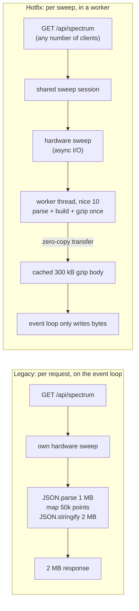

# DAS 01 · Hotfix for the shipped release (Node.js, backend-only)

**Goal:** stop the false "server is dead" alarms while the Spectrum Analyzer runs,
in a patch customers can install on the release they already have.

* **No frontend change needed.** Same URLs, same response bodies (byte-identical,
  covered by tests), same authentication.
* **No new binaries or npm packages on the device.** It uses only Node built-ins
  (`worker_threads`, `zlib`), and the runtime code is ES2019 (Node 12.16+).
* **Kill switch:** `DAS_MODE=legacy` restores the old code path at the next restart.

## Results

`npm run demo` runs identical load against the legacy code path and the hotfix. The load
is 4 engineers, each with 2 spectrum traces open (50,001-point sweeps), plus dashboard
and config polling. The server is pinned to **one CPU core** with an embedded-class CPU
emulated (8x slower), and a 10 % background load stands in for the other daemons on
the Master Node. Full interactive report: `bench/results/latest.html`.

| | legacy (shipped) | hotfix |
|---|---:|---:|
| Heartbeat p50 / p99 | 2,031 ms / 3,000 ms (timeout) | **1.3 ms / 5.7 ms** |
| Heartbeats timed out | 48 of 125 | **0 of 120** |
| False "server dead" alarms in 30 s | 19 | **0** |
| Config read p95 | 10,001 ms (timeout) | **4.2 ms** |
| Dashboard (volatile-data) p95 | 10,001 ms (timeout) | **50 ms** |
| Spectrum updates per trace per minute | 18.5 | **30** |
| Hardware sweeps needed | 74 | **60** (shared between viewers) |
| Spectrum data sent to browsers | 148 MB | **36 MB** |
| Server memory (RSS) peak | 211 MB | 239 MB |

Without the background load (`--background-load 0`) the legacy build stays just under
the 3 s timeout: heartbeat p50 750 ms, max 1.75 s, config reads p95 4.6 s. The hotfix
gives the same ~1-7 ms either way. The shipped code runs at the edge of the cliff,
and any extra load on the device pushes it over.

## Try it (2 minutes, Node 18+ on your PC)

```sh
npm test            # 39 tests: compatibility, worker pool, SLO, HTTP semantics, revisions
npm run demo        # legacy vs hotfix, ~75 s; opens nothing, writes bench/results/latest.html
npm start           # hotfix server on :8080 (npm run start:legacy for the old behaviour)
```

Against a real device, from a laptop:

```sh
node bench/heartbeat-under-load.js --base http://<master-node-ip> --spectrum legacy --duration 60
```

## What changed



| Area | Change |
|---|---|
| Spectrum | One sweep session per analyzer configuration, shared by all viewers. Parse, legacy JSON build and gzip happen once per sweep in a worker thread at lower priority. Legacy poll semantics are kept: each poll returns a sweep completed after the request arrived. |
| New spectrum endpoint (opt-in) | `GET /api/spectrum/latest`: compact JSON or binary (`Accept: application/vnd.das.spectrum`), `?maxPoints=` peak-detector decimation (2 MB → 3 kB), ETag/304, `?waitMs=` long-poll. |
| volatile_data | Incremental serialisation (each node stringified once per change), one snapshot per revision per second, gzip in the libuv pool, ETag/304, opt-in `?since=<rev>` deltas. |
| Heartbeat | Registered first, does no I/O, reports event-loop lag and worker health (`status: degraded`). |
| Config | Optional `If-Match` optimistic locking: 412 instead of silently overwriting a colleague's change. |
| Operations | Blocked-loop detector logs `event_loop_blocked` with the suspect URL. `/api/metrics` returns JSON or Prometheus text. Worker crash/timeout recovery, bounded queue, capped worker heap. |
| Discovery | `GET /api/capabilities` lets newer frontends switch on the opt-in features. |

## Project layout

```
src/
  server.js              PoC server (zero dependencies), DAS_MODE=hotfix|legacy
  config.js              all tunables (environment variables)
  hotfix/handlers.js     the new handlers (same URLs)
  legacy/handlers.js     faithful reproduction of the shipped behaviour, for the demo
  shared/                worker pool, spectrum sessions, volatile store, codecs, simulators
test/                    node:test suites (compatibility, worker pool, SLO, HTTP)
bench/                   load generator, legacy-vs-hotfix comparison, HTML report
examples/express-app.js  mounting the hotfix in an Express app (tested)
frontend-patch/          optional Angular 14+ files: tolerant connection monitor, ETag interceptor, polling
deploy/                  systemd drop-in and SysV env file
scripts/                 find-blocking-calls.sh, device-profile.sh, check-syntax.js (ES2019 guard)
docs/                    ROOT-CAUSE.md, INTEGRATION.md, ROLLOUT.md
```

## Read next

* [docs/ROOT-CAUSE.md](docs/ROOT-CAUSE.md): what really happens (sequence diagram, 6 contributing factors).
* [docs/INTEGRATION.md](docs/INTEGRATION.md): moving this into the real backend (2-4 dev days).
* [docs/ROLLOUT.md](docs/ROLLOUT.md): risk table, test plan, kill switch, release note.

## What this hotfix does not solve (by design)

It is still one Node.js process: any other blocking code in the backend still hurts,
though it is now detected and logged. Spectrum throughput is still bounded by the device
CPU. The browser's 6-connections-per-origin limit still applies. The next steps are
`das-02-gateway-multiservice` (process isolation, nginx single origin, HTTP/2, WebSocket
push) and `das-03-lts-go-edge` (Go data plane, the long-term fix).

## Notes on the demo

* `DAS_CPU_SLOWDOWN=8` repeats every heavy CPU operation 8 times, in both modes,
  wherever it runs (event loop, worker, libuv pool). This approximates a Cortex-A53-class
  core on a laptop. On the real device leave it at 1 (the default).
* The server is pinned with `taskset` to one core, and the load generator runs on another.
* The RF hardware and the Remote Nodes are simulated (`src/shared/spectrum-sim.js`,
  `node-sim.js`) with realistic payloads: EU DAS downlink carriers, CW spurs, 300 nodes
  with ~80 fields each.
