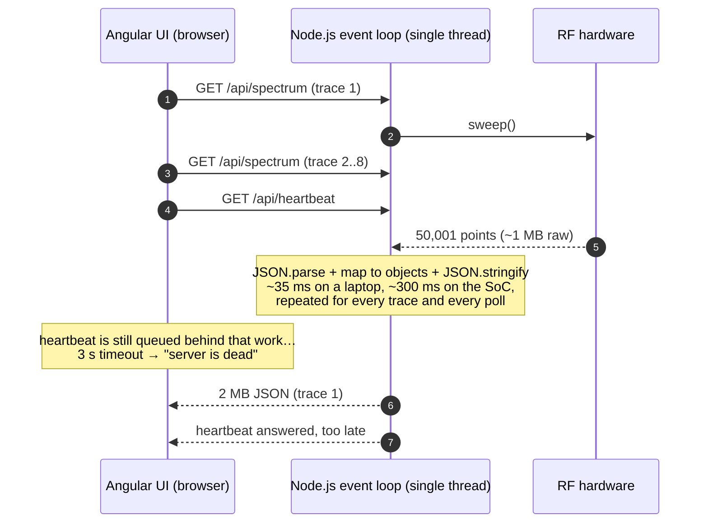

# Root cause: why the UI says "server is dead" while the spectrum analyzer runs

## Symptom

An engineer opens the Spectrum Analyzer. Within seconds the Angular UI raises the
"server is dead" alarm, even though the Master Node is running fine. Other views
freeze, configuration changes hang, and when the alarm clears everything catches up
at once.

## Mechanism

Node.js runs all JavaScript on **one thread**, the event loop. I/O is
asynchronous, but CPU work is not: while a request handler parses or serialises,
nothing else runs. That includes the handler that would answer `/api/heartbeat`.

## Contributing factors (all present in the shipped release)

| # | Factor | Effect |
|---|---|---|
| 1 | **Work per request, not per change.** Every poll triggers its own hardware sweep, parse, transform and serialise. | CPU grows with the number of engineers × traces × poll rate. 8 traces mean 8x the work on the one thread. |
| 2 | **Heavy payload shape.** `points: [{frequency, power}, …]` is ~40 bytes of JSON per point: 2 MB per sweep, uncompressed. | CPU to build it, time on the wire, and CPU in the browser to parse it again. |
| 3 | **volatile_data re-serialised on every request.** The whole merged state of hundreds of Remote Nodes is `JSON.stringify`-ed for every dashboard poll. | Another multi-ms block per poll. It grows with node count. |
| 4 | **Embedded CPU.** A Cortex-A53-class core runs V8 roughly 6-10x slower than a developer laptop. | A 35 ms block on the laptop is 300 ms on the device. It stayed invisible in development and shows up at customer sites. |
| 5 | **Browser connection limit.** Over HTTP/1.1 a browser opens at most 6 connections per origin. | While large spectrum downloads occupy connections, the heartbeat can wait in the browser's own queue. |
| 6 | **Heartbeat semantics.** One timeout = "dead", and successful responses from other endpoints are ignored. | A busy but healthy server is reported as dead: a false alarm. |

Other patterns that cause the same symptom and are worth checking in the real code base
(`scripts/find-blocking-calls.sh` greps for all of them):

* `execSync` / `spawnSync` used to talk to the RF hardware or a CLI tool.
* `fs.*Sync` writes on flash storage, where an erase cycle can stall for hundreds of ms.
* `console.log` of large objects. Writes to files and TTYs are **synchronous** on
  Linux, and on a 115200-baud serial console 10 kB of log output blocks for ~0.9 s.
* Deep clone / deep merge (`cloneDeep`, `merge`, `JSON.parse(JSON.stringify(x))`) of
  volatile_data on every node report.

## Evidence (reproduced in this project)

`npm run demo` runs the same load against the legacy code path and the hotfix. The
load is 4 engineers, each watching 2 spectrum traces (50,001 points), plus dashboard
and config polling. The server is pinned to one CPU core with the embedded CPU emulated
(8x), and 10 % of that core is busy with other work, as on a real Master Node. See
`bench/results/latest.html`.

| | legacy | hotfix |
|---|---:|---:|
| Heartbeat p50 / p99 | 2,031 ms / 3,000 ms (timeout) | 1.3 ms / 5.7 ms |
| False "server dead" alarms in 30 s | 19 | 0 |
| Config read p95 | 10,001 ms (timeout) | 4.2 ms |
| Dashboard (volatile-data) p95 | 10,001 ms (timeout) | 50 ms |
| Spectrum updates per trace per minute | 18.5 | 30 |
| Spectrum data sent | 148 MB | 36 MB |

Without the background load, the legacy build stays just under the 3 s timeout most of
the time. The shipped code runs at the edge of the cliff, and any extra load on the
device pushes it over.

## What the hotfix changes, factor by factor

| Factor | Hotfix |
|---|---|
| 1 | One **sweep session** per analyzer configuration. Every client watching it shares its sweeps. The body is built **once per sweep**, not once per request. |
| 1, 4 | All parsing, transformation, serialisation and compression runs in a **worker thread** at lower CPU priority (Linux nice is per thread). Buffers move between threads with zero-copy transfer. The event loop only writes bytes. |
| 2 | Same JSON (byte-identical, verified by tests), gzip-compressed once per sweep (level 1: ~85 % smaller). New opt-in endpoint `/api/spectrum/latest`: compact JSON or a binary frame, decimated to screen width with a peak detector (~3 kB instead of 2 MB). |
| 3 | **Incremental serialisation**: each node is stringified once when its report arrives. A snapshot is a string join, built at most once per revision (1/s), gzip-ed in the libuv pool, and served with **ETag/304**. |
| 5 | Responses become ~6x smaller and finish sooner, so connections free up faster. The full fix is HTTP/2 or WebSocket, in the gateway and LTS projects. |
| 6 | The heartbeat reports event-loop lag and worker status (`status: degraded`). An optional frontend patch adds hysteresis and counts any successful response as proof of life. |

## What the hotfix deliberately does not change

* URLs, response shapes, status codes and authentication are unchanged, so the
  shipped frontend keeps working.
* It is still one Node.js process. A bug that blocks the loop elsewhere in the code
  base still hurts, and the blocked-loop detector logs it with the suspect URL.
  Process isolation comes in `das-02-gateway-multiservice`.
* Spectrum throughput is still bounded by the device CPU. The hotfix makes it fair
  and predictable, not free.
