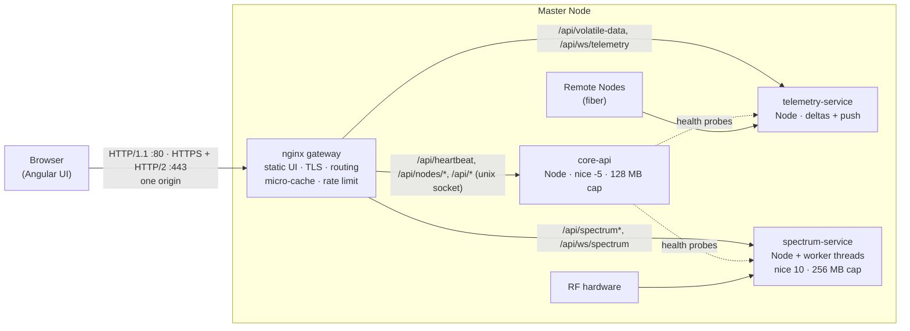

# DAS 02 · Gateway + isolated services + WebSocket push (mid-term)

**Goal:** make the "server is dead" class of problem structurally impossible in the next
regular release, still with the team's current language (Node.js), and **without the
browser ever seeing more than one server**.



| Option you asked about | Where it is in this project |
|---|---|
| Multiple web servers serving different APIs | Three Node services, one process each, on Unix sockets, each in its own systemd cgroup |
| A dedicated server for heavy data (spectrum) | `spectrum-service`: lowest CPU priority, hard memory cap, worker threads |
| WebSockets instead of HTTP | `/api/ws/telemetry` (JSON deltas, permessage-deflate) and `/api/ws/spectrum` (binary frames) |
| Push only when data changed (checksum) | Change detection on normalised state (field hygiene + deadbands), one delta per revision, resumable |
| Looks like one API / one server | nginx is the single origin: same host, same port, same cookie. The frontend never knows how many processes exist. |

## Results

**Same load as das-01's demo**: 4 engineers × 2 spectrum traces, dashboards, config reads.
nginx and all three services are pinned to **one** CPU core, with an embedded-class CPU
emulated (8x) and 10 % background load. Report: `bench/results/latest.html`.

| | legacy (shipped) | hotfix (01) | **gateway (02)** |
|---|---:|---:|---:|
| Heartbeat p50 / p99 | 2,031 / 3,000 ms (timeouts) | 1.3 / 5.7 ms | **1.8 / 11.1 ms** |
| False "server dead" alarms (30 s) | 19 | 0 | **0** |
| Config read p95 | 10,001 ms (timeout) | 4.2 ms | **5.2 ms** |
| Dashboard p95 | 10,001 ms (timeout) | 50 ms | **58 ms** |
| Spectrum updates per trace per minute | 18.5 | 30 | **27** |
| Spectrum data sent | 148 MB | 36 MB | **32 MB** |
| Memory (whole backend) | 211 MB peak | 239 MB peak | **286 MB peak** (PSS, 4 processes) |

**Isolation** (`npm run demo:isolation`): a simulated bug blocks spectrum-service's
event loop for 5 s.

| t (s) | heartbeat max | heartbeat status | services.spectrum | telemetry deltas/s | config reads/s | spectrum responses/s |
|---|---:|---|---|---:|---:|---:|
| 0-2 | 3-5 ms | ok | ok | 1 | 2 | 4 |
| 3-7 (blocked) | **3-5 ms** | ok → **degraded** | ok → **degraded** | **1** | **2** | 0 |
| 8-11 | 3-6 ms | ok | ok | 1 | 2 | 4 |

With one process, the same bug would freeze everything, including the heartbeat. With the
gateway, the UI can say "spectrum service busy" and everything else keeps working. When
core-api itself restarts, nginx answers the heartbeat with `status: degraded, services:
{core-api: down}` instead of letting the browser time out.

**Push vs poll** (`npm run demo:push`, 20 dashboards, 30 s, real network stack):

| mode | requests | wire traffic | data age at the client p50 / p95 | telemetry-service CPU |
|---|---:|---:|---:|---:|
| poll every 2 s (ETag + gzip, micro-cached) | 299 | 872 kB/s | 1,770 / 2,722 ms | 1.34 s |
| **WebSocket push (deltas, deflate)** | **20** | **190 kB/s** | **13 / 25 ms** | 1.55 s |

Push uses 4.6x less bandwidth and delivers data ~130x fresher, at the same CPU.
About 8 % of nodes change per second after deadbands, versus 100 % without them.

## Run it (Linux/macOS/WSL: Node 18+, nginx, openssl)

```sh
npm install                        # one dependency: ws (pure JS, no native build)
npm test                           # 11 tests, incl. end-to-end through a real nginx
sh scripts/run-local.sh            # stack on http://127.0.0.1:8080 and https://127.0.0.1:8443 (HTTP/2)
npm run conformance                # the shared API contract: 18/18 checks
npm run demo:isolation             # block spectrum-service, watch everything else keep working
npm run demo:push                  # 20 dashboards: poll vs push
node bench/gateway-under-load.js --compare-with ../das-01-hotfix-node/bench/results/compare-<stamp>.json
```

Serve the real UI: build `das-04-angular-client` and start with
`WEB_ROOT=/path/to/dist/browser sh scripts/run-local.sh`.

## On the device

```sh
sh deploy/install-device.sh /opt/das-web     # users, sockets dir, nginx config, TLS cert, systemd units
systemctl status das.target
```

| File | What it does |
|---|---|
| `deploy/systemd/das-*.service` | One unit per process. Priorities: core-api & nginx `Nice=-5 CPUWeight=400`, telemetry `CPUWeight=200`, spectrum `Nice=10 CPUWeight=50 MemoryMax=256M`. Restart in 1 s. Sandboxed. |
| `deploy/systemd/das.slice` | Caps the whole web stack (512 MB), so the RF/alarm daemons always keep their share |
| `deploy/tmpfiles/das.conf` | `/run/das` on tmpfs: sockets, nginx cache and temp files never touch flash |
| `gateway/nginx/*.template` | The routing table; `scripts/render-nginx.js --profile device` renders it (`rendered-device/` is the result, validated with `nginx -t`) |

nginx is in Yocto (`meta-webserver`: `nginx`) and Buildroot (`BR2_PACKAGE_NGINX`). Measured
here, the whole nginx (master, worker, cache manager) uses ~9 MB PSS. core-api uses ~27 MB,
telemetry-service ~49 MB, and spectrum-service ~132 MB (including the simulator's sweep
templates and one worker thread).

## What changed compared with the hotfix

| Concern | Hotfix (01) | Gateway (02) |
|---|---|---|
| Blast radius of a blocking bug | whole backend | one service |
| Heartbeat semantics | "process alive" | "device reachable" + per-service health |
| Browser connection limit (6 per origin) | still applies | HTTP/2 on :443: one multiplexed connection |
| Static UI files | served by Node | nginx (`gzip_static`, immutable caching) |
| Dashboard polling cost | once per revision | micro-cache: at most 1 upstream request/s for any number of clients |
| Slow clients | Node buffers their data | nginx buffers (spectrum); WebSocket conflation (push) |
| Telemetry updates | poll | push on change, resumable, ~4x less traffic |
| Resource control | one process | per-service `Nice`, `CPUWeight`, `MemoryMax`, restart policy |

## Trade-offs (be honest in the review)

* **Memory:** three Node processes cost ~50 MB more than the single-process hotfix (each V8
  instance has a ~40 MB baseline). On a 512 MB device that matters, and it is the main
  reason the long-term project replaces the data plane with one Go process (das-03).
* **More moving parts:** four processes, sockets, nginx config. systemd units, the
  install script and `nginx -t` in `ExecStartPre` keep it manageable.
* **Spectrum throughput** is still bounded by the device CPU. Isolation makes it safe,
  not faster.
* **Frontend:** push needs the new client (das-04), which discovers features via
  `/api/capabilities` and falls back to polling. The shipped frontend keeps working unchanged.

## Alternatives considered

| Instead of | Considered | Why not (here) |
|---|---|---|
| nginx | HAProxy | Excellent proxy, but no static file serving; one more component for the UI |
| nginx | lighttpd | Smaller, but weaker WebSocket/HTTP-2 proxying and caching |
| nginx | Caddy / Traefik / Envoy | Tens-of-MB binaries and a larger memory footprint (Go GC or a big C++ runtime); built for cloud and containers, not a SoC |
| WebSocket | Server-Sent Events | Simpler and HTTP/2-friendly, but text-only (spectrum is binary) and subject to the 6-connection limit on HTTP/1.1 |
| own push hub | MQTT broker (Mosquitto) over WebSocket | Very light, IoT-standard, retained messages. A good option if Remote Nodes also move to MQTT; adds a second protocol and ACL model for the UI |
