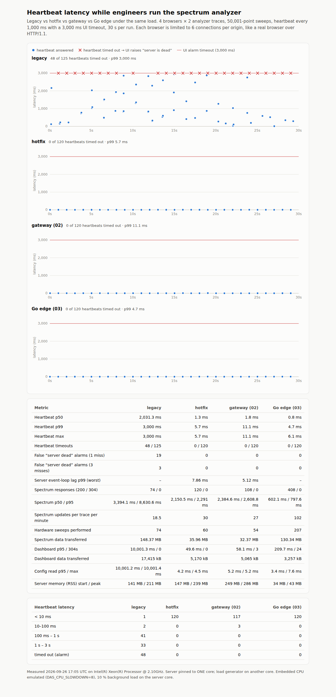

# Measurements

All numbers were measured on a development machine with the scripts in this repository.
They compare **designs under identical conditions**. They are not a prediction for a
specific Master Node: repeat them on the device before quoting absolute values (commands
below).

## Emulating the device

- The server is pinned to **one core** (`taskset -c 0`); the load generator runs on
  another core.
- `DAS_CPU_SLOWDOWN=8`: every heavy operation (encoding, compression, normalisation) runs
  8 times, which approximates an embedded ARM core against a desktop x86 core. The Node
  projects use the same switch, so the comparison is fair.
- A background process burns **10 % of the server's core** to stand in for the other
  daemons (RF control, SNMP, alarms).
- Browsers are emulated faithfully: 6 connections per origin (HTTP/1.1), latency measured
  from the moment a request is issued (so time spent queued in the browser counts), and
  the UI's 3 s heartbeat timeout.

## Heartbeat under spectrum load (`make bench`)

4 engineers × 2 spectrum traces on the legacy endpoint (50 001 points), dashboards every
2 s, config reads every 3 s, heartbeat every 1 s, 30 s run.

| | Shipped release | Hotfix (01) | Gateway (02) | Go edge (03) |
|---|---:|---:|---:|---:|
| Heartbeat p50 / p99 | 2 031 / 3 000 ms | 1.3 / 5.7 ms | 1.8 / 11.1 ms | **0.8 / 4.7 ms** |
| Timeouts (3 s) / false alarms | 48 / 19 | 0 / 0 | 0 / 0 | **0 / 0** |
| Spectrum responses (p50) | 74 (3.4 s) | 120 (2.2 s) | 108 (2.4 s) | **408 (0.6 s)** |
| Distinct sweeps delivered | 74 | 60 | 54 | **207** |
| Dashboard p50 / p95 | 2.1 s / 10.0 s (15 errors) | 28 / 50 ms | 1.2 / 58 ms | **1.0 / 210 ms** |
| Config API p50 / p95 | 2.2 s / 10.0 s (9 errors) | 1.4 / 4.2 ms | 1.7 / 5.2 ms | **0.8 / 3.4 ms** |
| Memory, peak | 211 MB RSS | 239 MB RSS | 286 MB PSS (4 processes) | **43 MB PSS** |

Report with timelines: `bench/results/latest.html`. The previous runs come from das-01's
and das-02's result files (`--compare-with`).



The edge also delivers **3.4× more spectrum responses** than the hotfix. Each sweep is
encoded once per representation, and the encoding threads are not starved by request
handling.

### Why the encoding threads are reniced

The same benchmark with encoding on ordinary goroutines gave heartbeat p99 26.9 ms and
config p50 15.5 ms: fine, but not better than the hotfix. Go has no goroutine priorities.
Running heavy work on dedicated OS threads at nice +10 (`internal/heavy`) lets the kernel
prefer request handling. That brought p99 to 4.7 ms, config p50 to 0.8 ms, and raised
spectrum throughput from 268 to 408 responses.

Snapshots of `volatile_data` are built right after each publish, in the background.
Without that, dashboard polls waited behind spectrum encodes (p50 154 ms); with it, p50
is 1.0 ms.

## Remote Node ingest (`make demo-ingest`)

300 nodes, 1 measurement/s each, 60 s, deadbands at the source:

| | Full JSON per measurement | Deltas + hash (this protocol) |
|---|---:|---:|
| Messages | 17 836 | 3 807 |
| Bytes | 21.2 MB | 0.88 MB (**24×** less; 40× in steady state) |
| Master CPU | – | 1.4 s / 60 s |
| Resyncs, hash mismatches | – | 0, 0 |

## Strangler-fig steps (`make strangler`)

The edge in front of the shipped behaviour (`das-01 --legacy`), one endpoint group moved
per step. The full conformance suite runs at each step:

| Step | Conformance | Heartbeat p99 under 6 spectrum pollers |
|---|---|---|
| 1: everything delegated | 6 passed, 12 skipped, 0 failed | 6.8 ms |
| 2: spectrum on the edge | 11 passed, 7 skipped, 0 failed | 7.2 ms |
| 3: + volatile_data | 14 passed, 4 skipped, 0 failed | 6.1 ms |
| 4: + WebSocket push | 18 passed, 0 skipped, 0 failed | 7.7 ms |

## Other measurements

| What | Result | How |
|---|---|---|
| Slow WebSocket client | 300 revisions on a throttled link arrive as **2 messages** (catch-up or snapshot); no queue growth | `go test ./internal/hub -run Conflation -v` |
| Telemetry change rate | 300 raw reports/s → 10.8 published node changes/s with field hygiene + deadbands | `go test ./internal/telemetry -run ChangeRate -v` |
| Binary size | arm64 7.3 MB, armv7 7.5 MB, amd64 7.8 MB (≈3 MB gzipped) | `make sizes` |
| Memory at idle | 20–27 MB RSS with 300 simulated nodes | `/api/heartbeat` → `runtime.rssMB` |
| Conformance | 18/18 (HTTP), 17/17 + SLO skipped (HTTPS, HTTP/2) | `make conformance` |
| Angular end-to-end | 3/3 against the edge serving the build | `make e2e` |
| ARM | arm64 and armv7 binaries serve heartbeat and binary spectrum under qemu | `qemu-aarch64-static dist/das-edge-linux-arm64` |

## On a real Master Node

```sh
make cross
scp dist/das-edge-linux-arm64 master:/tmp/das-edge
ssh master /tmp/das-edge -listen :8080 &             # (stop the production service first, or use another port)
node bench/heartbeat-under-load.js --base http://master:8080 --duration 60 --browsers 4 --analyzers-per-browser 2
node conformance/run.js --base http://master:8080
```

Do not set `DAS_CPU_SLOWDOWN` on the device. For the ingest numbers, run
`das-nodesim -master http://master:9090` from a laptop on the management network, with
the edge started with `-nodes 0 -ingest :9090`.
