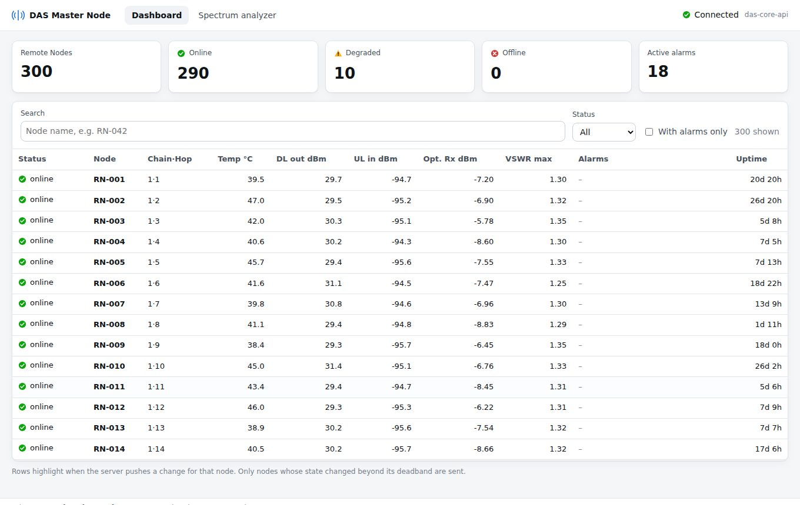
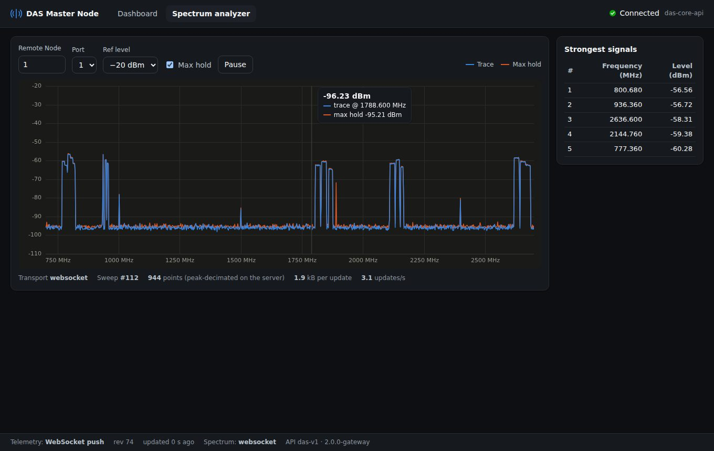
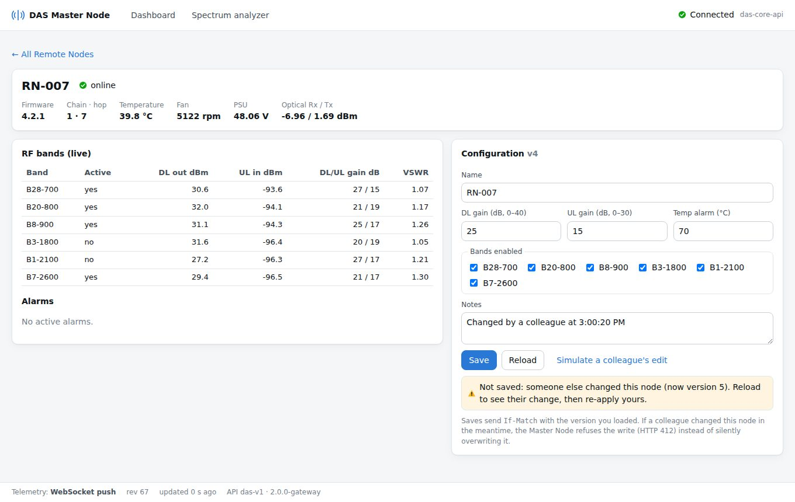

# DAS 04 · Angular reference client (works with every backend)

One Angular app that runs unchanged against **all** backends in this programme: the
shipped release, the Node hotfix (01), the gateway with split services (02) and the Go
edge server (03). It asks the server what it can do (`GET /api/capabilities`) and picks
the best transport. The browser always talks to one origin.

| Backend | `/api/capabilities` | Telemetry transport | Spectrum transport |
|---|---|---|---|
| Shipped release (legacy) | 404 | HTTP polling, full snapshot | legacy JSON, decimated in the browser |
| 01 hotfix | etag, volatileDelta, spectrumBinary | HTTP `?since=` deltas + ETag | binary DSPC frames, long-poll, decimated on the server |
| 02 gateway | + wsTelemetry, wsSpectrum | **WebSocket push** (deltas, resumable) | **WebSocket binary push** |
| 03 Go edge | same as 02 | WebSocket push | WebSocket binary push |

If a WebSocket cannot be opened (proxy, firewall), the client falls back to HTTP by itself.
This was tested: with WebSockets refused, the UI kept working on HTTP deltas.





## What it demonstrates

* **No false "server is dead".** `ConnectionMonitorService` has three states (online,
  degraded, offline) with hysteresis. Offline needs 3 missed heartbeats **and** 15 s
  without any successful response. WebSocket traffic and every HTTP response count as
  proof of life. A gateway that reports `services.spectrum: degraded` shows
  "spectrum service busy" instead of "dead".
* **Push instead of poll.** `TelemetryFeed` applies a snapshot, then deltas. A delta that
  does not fit the current revision triggers a resync request for exactly the missing
  revisions. After a reconnect it resumes from the last revision it applied.
* **Binary spectrum, zero parsing.** `decodeFrame()` views the WebSocket payload as an
  `Int16Array`. The canvas width in device pixels is sent as `maxPoints`, so the server's
  peak detector sends only what can be drawn: ~2 kB per update instead of ~2 MB.
* **Rendering that scales.** Zoneless change detection plus signals: a delta re-renders
  only the table rows that changed. The spectrum is drawn on a canvas, coalesced to one
  draw per animation frame.
* **Safe configuration.** Saves send `If-Match`. A concurrent edit by a colleague gives
  HTTP 412 and a clear message instead of a silent overwrite. The page has a
  "Simulate a colleague's edit" button for demos.
* **The hotfix's optional frontend patch in use.** `src/app/core/connection/` contains
  the exact files shipped in `das-01-hotfix-node/frontend-patch/`, compiled here under
  Angular 21 strict mode and covered by unit tests.

## Run

```sh
npm install                  # .npmrc sets legacy-peer-deps (works around an npm 10 peer-resolution bug with vitest)
npm start                    # ng serve on :4200, /api proxied to http://127.0.0.1:8080 (proxy.conf.json, ws: true)
npm test                     # 13 unit tests (Vitest): frame decoder vs the Node encoder, delta model, heartbeat state machine
npm run build                # dist/das-04-angular-client/browser  (~81 kB initial transfer)
```

Try the new UI against **any** device, including a customer unit on the shipped release,
without touching the device:

```sh
npm run build
node scripts/serve.mjs --api http://<master-node-ip> --port 4300     # open http://127.0.0.1:4300
```

`serve.mjs` has no dependencies. It serves the build and forwards `/api` (HTTP and
WebSocket) to the device, so the browser still sees one origin.

End-to-end tests (Playwright) against a running stack:

```sh
npx playwright install chromium        # once
E2E_BASE_URL=http://127.0.0.1:8080 npm run e2e
```

They were run against the hotfix (via `serve.mjs`), the gateway and the Go edge.

## Deploy

* **Gateway (02):** copy `dist/das-04-angular-client/browser/*` to `/usr/share/das-ui` (nginx `root`).
* **Go edge (03):** `-web dist/das-04-angular-client/browser`, or embed the build in the binary at compile time.

Angular emits content-hashed file names, so both servers cache assets as immutable and
serve `index.html` with `no-cache`.

## Structure

```
src/app/core/
  capabilities.service.ts      feature discovery (404 = legacy backend)
  telemetry-feed.service.ts    WS push -> HTTP deltas -> HTTP polling; signals
  telemetry-model.ts           pure snapshot/delta state transitions (unit-tested)
  spectrum-feed.service.ts     WS binary -> HTTP binary long-poll -> legacy JSON
  spectrum-frame.ts            DSPC v1 decoder + client-side peak decimation
  config-api.service.ts        GET/PUT with ETag / If-Match (412 handling)
  connection/                  = das-01 frontend patch (monitor, interceptors, polling)
src/app/features/
  dashboard/                   summary tiles + 300-node table (changed rows highlight)
  spectrum/                    canvas renderer, max hold, peak table, hover readout
  node-detail/                 live bands/alarms + configuration editor
scripts/serve.mjs              zero-dependency static server + /api proxy (HTTP + WS)
e2e/                           Playwright tests
```

Built with Angular 21.2 (standalone, zoneless, signals). The newer Angular 22 needs
Node ≥ 22.22.3; `ng update @angular/core@22 @angular/cli@22` is the only step
needed to move up.
