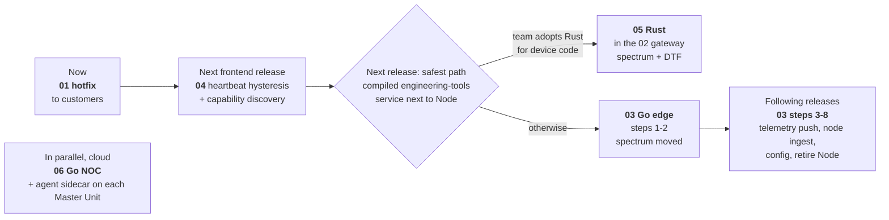
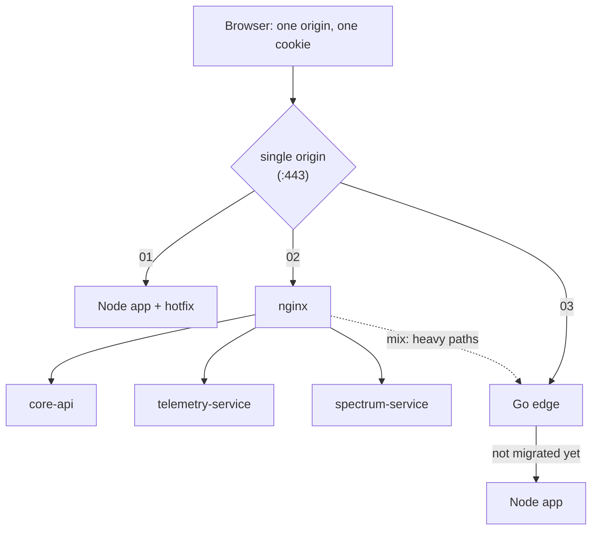

# DAS Master Node web backend: from false "server is dead" alarms to a long-term architecture

**Start here.** This project holds the analysis, the options, the target architecture,
the roadmap, and the API contract that the other projects implement.

## The problem in one paragraph

When an engineer opens the Spectrum Analyzer, the Node.js backend on the Master Node
parses and serialises tens of thousands of points **for every poll** on its **single
event loop**. That is ~300 ms of blocking per trace on an embedded CPU. The lightweight
`/api/heartbeat` waits behind it, the UI's 3 s timeout fires, and the UI reports a dead
server that is merely busy. `volatile_data` from hundreds of Remote Nodes adds more of
the same: the whole merged state is re-serialised per request, and every report counts
as a change. Full analysis: `das-01-hotfix-node/docs/ROOT-CAUSE.md`.

## The seven projects (one zip each)

| # | Project | What it is | For whom / when | Change to the product |
|---|---|---|---|---|
| 00 | **architecture-and-contract** (this) | Analysis, options, target architecture, roadmap, ADRs. The **das-v1 contract**: OpenAPI, AsyncAPI, protobuf, binary frame spec. **Conformance suite** | Team and management, now | none |
| 01 | **hotfix-node** | Patch for the **shipped release**. Same URLs, byte-identical responses, same auth. Worker threads at low priority, one shared sweep per analyzer, incremental serialisation, ETag/304. Kill switch. | **Customers with the issue, now** | backend only |
| 02 | **gateway-multiservice** | nginx as the single origin; separate Node processes for core, telemetry and spectrum; WebSocket push; systemd isolation | Next release if the team stays on Node | backend + nginx |
| 03 | **lts-go-edge** | **One static Go binary**: UI, REST, WebSocket push, Remote Node ingest with deltas and checksums (gRPC-compatible), strangler proxy to the Node app | **Recommended long-term (LTS)** | gradual, reversible |
| 04 | **angular-client** | Reference Angular 21 client: capability discovery, push with polling fallback, a heartbeat that tolerates slow responses, canvas spectrum | Frontend team, with 02/03 | frontend |
| 05 | **rust-engineering-tools** | A small **Rust** service for the Engineering Tools: Spectrum Analyzer (raw FPGA/DSP sweeps up to 200 001 bins) and new **Distance-to-Fault**. Runs next to the unchanged Node app: inside the 02 gateway, in front of the app, or behind it | Next release: the "safest path" of the Rust-vs-Go notes | device: one more process |
| 06 | **go-noc-controller** | A **Go** NOC for the whole fleet: every Master Unit keeps one outbound WebSocket (`das-noc.v1`); live fleet page, alarms, drill-down to the Remote Node table, REST, Prometheus, Kubernetes manifests. Device side: a Node.js sidecar reading `/api/volatile-data` | Cloud / operations | device: one sidecar; cloud: new service |

## Results: same load, same emulated device

4 engineers × 2 spectrum traces (50 001 points), dashboards and config reads, 30 s. The
server is pinned to **one core**, the embedded CPU is emulated (×8), and 10 % of that
core goes to other daemons. Details in [benchmarks/RESULTS.md](benchmarks/RESULTS.md).

| | Shipped release | 01 Hotfix | 02 Gateway | 03 Go edge |
|---|---:|---:|---:|---:|
| Heartbeat p99 | 3 000 ms (timeout) | 5.7 ms | 11.1 ms | **4.7 ms** |
| False "server dead" alarms in 30 s | **19** | 0 | 0 | 0 |
| Spectrum responses delivered | 74 | 120 | 108 | **408** |
| Config read p95 | 10 s (timeout) | 4.2 ms | 5.2 ms | **3.4 ms** |
| Backend memory, peak | 211 MB | 239 MB | 286 MB (4 processes) | **43 MB** |

Other measured results:

- **Isolation (02):** with the spectrum service blocked for 5 s, the heartbeat stays at
  3–5 ms and telemetry and configuration keep working.
- **Push vs poll (02, 20 dashboards):** 4.6× less bandwidth, data ~130× fresher.
- **Remote Node ingest (03, 300 nodes):** 24× fewer bytes on the fiber, 0 resyncs.
- **Migration (03):** each strangler step in front of the shipped behaviour passes the
  conformance suite.

## Rust on the device, Go in the cloud (05, 06)

A later set of notes proposed **Rust for the device data plane** (parsing FPGA/DSP output
on the Master Unit) and **Go for the cloud control plane** (a NOC that thousands of Master
Units phone home to), with a "safest path" of a tiny compiled microservice for the
Engineering Tools next to Node.js. Both were built and measured:

| | Measured |
|---|---|
| **05 Rust engineering tools** next to the unchanged shipped app | Same standard load as above: **0 heartbeat timeouts in 6 runs** (the app alone: 48 of 125). 144–151 spectrum updates/min per trace (shipped app: 18.5). 14–17 MB of memory. Distance-to-Fault: 0 missed and 0 phantom faults over 2 511 simulated reflections. das-v1 conformance 21/21 inside the 02 gateway. |
| **06 Go NOC** | 5 000 simulated Master Units + 26 dashboards on **one core**: 13.8 % CPU, 127 MB RSS, alarm to screen p99 51 ms; 20 000-alarm storm with 0 events lost; NOC restart under load: fleet back in 32 s; 0 differences between the NOC and 5 000 devices, three times. 10 000 sites: 22 % CPU, 232 MB. |

Several claims in the notes are overstated, and each project documents the evidence
(05 `docs/WHY-RUST.md`, 06 `docs/WHY-GO.md`): Rust is **not** "the only memory-safe
language fast enough" (NSA/CISA list Go, Java, C#, Swift and others; the Go edge 03 met the
same heartbeat SLO); Go's GC pauses are **not** ~50 ms (measured p99 ≤ 0.5 ms on the device
and ≤ 0.33 ms in the NOC); the CISA document is **guidance**, asking for a memory-safety
roadmap for code in memory-unsafe languages (C/C++), not a mandate to rewrite Node.js.

## Recommendation



1. **Ship 01 to customers now.** It is backend-only, reversible with `DAS_MODE=legacy`,
   and ends the false alarms (19 → 0 in the demo).
2. **Put 04's heartbeat logic and capability discovery into the product UI.** A slow
   answer is "degraded", not "dead". The UI uses push and deltas where the backend
   offers them.
3. **Next device release: the "safest path"**, a compiled service for the Engineering Tools
   next to the unchanged Node app, with the heavy traffic routed to it. It exists twice,
   both measured; one question decides: **will the team write the device's new low-level
   code (drivers, DSP daemons) in Rust anyway?**
   - **Yes: 05 (Rust) inside the 02 gateway.** The least CPU and memory (about 15 MB), and
     Distance-to-Fault today. Each step is undone by switching an nginx location back.
   - **No: 03 (Go edge), steps 1 and 2.** The same outcome (0 false alarms, spectrum off
     the Node event loop) with a much shorter learning curve for a TypeScript team.
     Distance-to-Fault would be ported (the FFT is the only missing piece).
4. **LTS: 03, step by step** (strangler fig), the highest score in the decision matrix:
   - Step 1 puts the Go edge in front of the Node app. It already stops false alarms,
     because the edge answers the heartbeat.
   - Step 2 moves the spectrum analyzer to the edge.
   - Later steps move telemetry, then Remote Node ingest, then configuration.

   Every step is one flag and can be undone by removing it. A team that chose Rust in
   step 3 keeps Node + Rust on the device instead; growing 05 into a full edge was not
   built here.
5. **Cloud: 06, independent of the device path.** The agent sidecar reads
   `/api/volatile-data`, which every backend above serves, so the NOC does not wait for the
   device decision. The agent needs Node.js 22 (or the `ws` package) on the Master Unit.
   Before customers get access, add single sign-on (06 `docs/OPERATIONS.md`).

Rationale, alternatives and risks: [docs/OPTIONS.md](docs/OPTIONS.md) ·
[docs/TARGET-ARCHITECTURE.md](docs/TARGET-ARCHITECTURE.md) ·
[docs/ROADMAP.md](docs/ROADMAP.md) · [docs/adr/](docs/adr/).

## "It must look like one API and one server"

Every backend implements **one contract**, `das-v1`, behind **one origin**:

- `contract/openapi.yaml` (REST), `contract/asyncapi.yaml` (WebSocket), `contract/proto/`
  (node ingest, gRPC/Connect), `contract/spectrum-binary-frame.md`.
- **Compatibility rules** ([contract/COMPATIBILITY.md](contract/COMPATIBILITY.md)):
  existing URLs and shapes are frozen, new behaviour is opt-in and discoverable through
  `GET /api/capabilities`, and validators do not survive a reboot.
- **Conformance suite** (`conformance/run.js`, zero dependencies). The same checks run
  against every backend, including a heartbeat SLO under spectrum load; each backend is
  tested on the features it advertises. 02 and 03 pass all 18 that apply to them; 02 with
  05 inside passes all 21, including the three Distance-to-Fault checks.
- The options **combine**:
  - the Go edge can sit in front of the Node app (`-legacy`) or behind the nginx gateway;
  - `/api/capabilities` merges what each process serves;
  - the Angular client picks WebSocket or polling from it.



## Your ideas, and where they ended up

| Idea | Verdict | Where |
|---|---|---|
| 1. Replace Node with a server better suited to embedded devices | **Yes, for the data plane: Go.** Also compared: Rust, C++ (Drogon/Crow), lighttpd/nginx+CGI, Node tuning (uWebSockets.js, cluster). | 03; comparison in OPTIONS.md |
| 2. Several web servers for different APIs | **Yes, as isolation**, but with one origin in front (nginx), never a second host/port for the browser | 02 (processes + cgroups); 03 (one process, priority threads) |
| 3. A dedicated server for spectrum and heavy APIs | **Yes.** The heavy path gets its own process (02) or its own low-priority threads (03), plus one sweep shared by all viewers | 01, 02, 03 |
| 4. WebSockets instead of HTTP | **Yes, for push** (telemetry deltas, binary spectrum frames), **keeping HTTP** for commands and as a fallback | 02, 03, 04 |
| 5. Change the architecture | **Yes:** work per change instead of per request, push, conflation, priorities, a contract with conformance tests, strangler migration | all |
| gRPC | **Yes where it fits: Remote Node → Master** (typed contract, one HTTP/2 stream per node). Not browser → device, where JSON + a binary frame over WebSocket is simpler and needs no proxy. | 03 ingest (Connect, gRPC-compatible) |
| Checksum: push only if changed | **Yes, at every layer:** state hash on node deltas, ETag/304 on HTTP, revisions + deltas on WebSocket, deadbands so noise is not a change | 01–04 |

## What is in this project

```
README.md                  this summary
docs/OPTIONS.md            every option with a decision matrix
docs/TARGET-ARCHITECTURE.md  the LTS design, SLOs, data flows
docs/ROADMAP.md            phases, exit criteria, risks, staffing
docs/PRESENTATION.md       slide outline, live demo script, expected questions
docs/adr/                  architecture decision records (8)
contract/                  OpenAPI 3.1 (incl. /api/dtf), AsyncAPI 3.1, protobuf (buf lint clean), frame spec, ingest protocol
conformance/run.js         the executable contract (node conformance/run.js --base <url>)
benchmarks/                results and HTML reports from all projects (start with RESULTS.md)
scripts/lint-contract.sh   OpenAPI (Redocly), AsyncAPI and buf lint for CI
```

Run the conformance suite against any backend (Node 22+ on your PC):

```sh
node conformance/run.js --base http://<master-node>:8080
node conformance/run.js --base https://<master-node> --insecure --skip-slo
```
