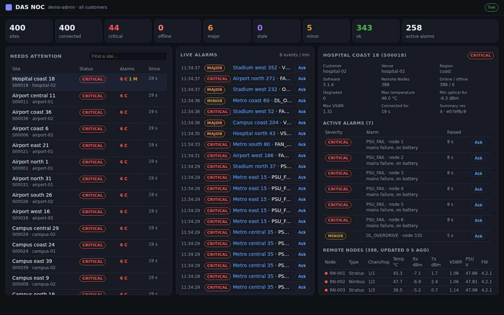

# das-06 · Go NOC fleet controller for DAS Master Units

`noc` is the cloud side of the programme: a network operations centre (NOC) service that
thousands of DAS Master Units (the Orion/Helix head-ends in stadiums, airports, hospitals
and metro stations) phone home to. Each Master Unit keeps **one outbound WebSocket** open
and reports its site summary, its alarms and, while someone looks, its Remote Node table.
NOC staff watch the whole fleet live in a browser page or through the REST API; each
customer sees only its own sites.

It is written in Go 1.24 with **the standard library only**, and ships as one static binary
(7.4 MB for linux/amd64, 6.9 MB for linux/arm64) with a container image and Kubernetes
manifests. On the Master Unit, a small sidecar (`agent/noc-agent.js`) reads the existing
Node.js backend's `/api/volatile-data`, like the Angular UI does, and speaks the uplink
protocol. The shipped device software does not change and the venue opens no inbound port.

This is the "Go for the cloud control plane" half of the Rust-vs-Go notes. The Rust half,
the engineering tools on the device, is `das-05`.

## Results (measured in this repository)

| | |
|---|---|
| **Scale** | 5 000 simulated Master Units and 26 live dashboards against **one NOC process on one core**: **13.8 % CPU**, **127 MB RSS** (live heap 38 MB, goroutine stacks 40 MB), 722 device messages/s. 10 000 sites on the same core: 22 % CPU, 232 MB. |
| **Alarm latency** | From the device's event to a dashboard: p50 **15 ms**, p99 **51 ms** in steady state. During a 20 000-alarm storm (1 000 sites × 20 critical alarms at once): p99 674 ms, with **0 events lost or out of order**. |
| **Restart** | NOC killed and restarted under full load: the **whole fleet is back in 32 s**, paced by admission control, and the NOC's state is rebuilt entirely from the devices. |
| **Correctness** | 3 checks × 5 000 sites, comparing each device's own summary hash and alarm counts with the NOC's view: **0 differences**. 4 customer dashboards: **0 events from other customers** out of 1 038 807 delivered. |
| **Real device software** | `scripts/agent-demo.sh`: the das-01 Node.js backend (300 simulated Remote Nodes) + `noc-agent.js` + the NOC. The summary hash computed in JavaScript and in Go agrees; the drill-down shows all 300 nodes. |
| **GC** | Stop-the-world pause p99 ≤ 0.20 ms at 5 000 sites and ≤ 0.33 ms at 10 000, far from the "50 ms" in the notes ([WHY-GO](docs/WHY-GO.md)). |
| **Robustness** | 27 tests and 2 fuzz targets, all run under the race detector. Fuzzing covered the WebSocket frame reader (2.3 million inputs) and the fleet store (0.9 million message sequences). The fuzzer found a crash in the frame reader that any connected peer could trigger; it is fixed, and so is the same bug in das-03. |

Every number comes from scripts in this repository ([docs/SCALE.md](docs/SCALE.md), with an
[interactive report](bench/results/scale-report.html)). **Not verified here:** a real
WAN, TLS at the ingress, real Master Units, and long soak tests. See the caveats in SCALE.md.



## Quick start

```sh
make                 # bin/noc and bin/fleetsim
make demo            # the NOC + 400 simulated Master Units; open the printed URL
```

| | |
|---|---|
| `make check` | `gofmt`, `go vet`, all tests with the race detector |
| `make demo` | NOC page with a live simulated fleet (a regional power failure after 90 s) |
| `make scale` | 5 000 simulated Master Units, storm, restart, consistency checks (about 6 minutes, 2 cores), then the HTML report |
| `make agent-demo` | the real das-01 Node.js backend + `agent/noc-agent.js` + the NOC (needs `../das-01-hotfix-node` and Node.js 22) |
| `make dist` | static binaries for linux/amd64 and linux/arm64 in `dist/`, with SHA-256 sums |
| `make image` | container image (distroless, non-root) |

Issue tokens with the same binary: `noc token -kind site -subject S00042 -tenant airport-01`
for a Master Unit, `noc token -kind user -subject alice -tenant '*'` for NOC staff.

## How it fits

```
 venue (one per site)                                   cloud
┌───────────────────────────────────────────┐        ┌──────────────────────────────────────────┐
│ Remote Nodes ── Master Unit               │        │ ingress (TLS) ─▶ noc (one Go process)    │
│   Node.js backend (unchanged)             │ wss:// │   /uplink/v1      devices                │
│     └── /api/volatile-data (loopback)     │ ─────▶ │   /               NOC page               │──▶ NOC staff, customers
│   noc-agent.js sidecar ── outbound only ──┼────────┼─▶ /api/…          REST, dashboard push   │──▶ integrations
└───────────────────────────────────────────┘        │   :9090           /metrics, /healthz     │──▶ Prometheus
                                                     └──────────────────────────────────────────┘
```

- **The devices are the source of truth.** The NOC keeps a cache of what they report;
  after a restart every device resends its summary and its active alarms. No database.
- **Deltas with a checksum.** A device sends only the summary fields that changed, chained
  by revision and verified by a canonical hash that both ends compute. A broken chain or a
  mismatch triggers a resync, rate-limited so it cannot loop.
- **Alarms are never lost or doubled.** Sequence numbers, a cumulative ack and an outbox on
  the device survive reconnects.
- **Detail on demand.** The Remote Node table streams only while an operator looks at the
  site.
- **Protection from its own fleet.** Admission control and randomised `Retry-After` spread
  reconnect storms; dashboards are fed by pull-based conflation, so a slow screen or an
  alarm storm costs batches, not queues.

[docs/ARCHITECTURE.md](docs/ARCHITECTURE.md) explains the design;
[docs/PROTOCOL.md](docs/PROTOCOL.md) specifies the uplink (`das-noc.v1`).

## API

Public listener (behind the ingress). REST calls need `Authorization: Bearer <user token>`
and are scoped to the token's tenant; a site of another tenant is "not found".

| Endpoint | |
|---|---|
| `GET /uplink/v1` | Master Unit WebSocket, subprotocol `das-noc.v1`, site token ([PROTOCOL](docs/PROTOCOL.md)) |
| `GET /api/ws/dashboard` | Dashboard WebSocket (`das-noc-dash.v1`, token as subprotocol `bearer.<token>`): subscribe to the overview, the alarm stream (with resume from an event number) and one site's detail; acknowledge alarms |
| `GET /api/fleet/summary` | Totals by status and severity, per customer (staff), and the 25 most urgent sites |
| `GET /api/sites?status=critical,major&q=&sort=&offset=&limit=` | Site list: filter, search, sort by severity, name, id or last seen |
| `GET /api/sites/{id}` | One site: summary, active alarms with acknowledgements, connection details |
| `GET /api/sites/{id}/detail?waitMs=3000` | The Remote Node table (asks the device to stream it for 60 s) |
| `GET /api/alarms?min=major&site=&unacked=1` | Active alarms |
| `GET /api/alarms/events?after=<n>` | The alarm event log (raised, cleared, acknowledged), for integrations |
| `POST /api/alarms/acknowledge` | `{site, id, note}` |
| `GET /api/me` | Who the token is |
| `GET /` | The NOC page |

Internal listener (`:9090`, never exposed): `/metrics` (Prometheus; `?format=json`),
`/healthz`, `/debug/pprof/`.

## Security

- Devices and people authenticate with HMAC-signed tokens. A device's site id and customer
  come from its token, never from what it says. Secret rotation accepts two secrets at
  once; revoked devices and users are refused within 10 s of the revoked list changing,
  and their open connections are closed ([OPERATIONS](docs/OPERATIONS.md)).
- The uplink refuses browsers (any `Origin` header). Browsers use the token as a WebSocket
  subprotocol, not a cookie, so cross-site WebSocket hijacking does not apply.
- Limits everywhere: message sizes, handshake admission, per-dashboard batching, write
  timeouts, `GOMEMLIMIT`.
- The container runs as non-root on a read-only filesystem with no capabilities.
- **Known gap:** user tokens do not expire. Before customers get access, put single sign-on
  in front ([OPERATIONS](docs/OPERATIONS.md#tokens)).

## Repository layout

```
cmd/noc/             the NOC: flags (each also DAS_NOC_*), token command, signals, revoked-list reload
cmd/fleetsim/        simulated fleet + dashboards; measures latency, memory, CPU, restart, consistency
internal/wsock/      WebSocket (RFC 6455) on net/http, with a fuzz test
internal/proto/      das-noc.v1 messages, canonical hash, tokens
internal/uplink/     device endpoint: auth, admission control, sessions, keep-alive
internal/fleet/      fleet state, aggregates, alarm log, views, registry (with a fuzz test)
internal/dash/       dashboard push: subscriptions, conflation, alarm batches
internal/api/        REST, security headers, metrics (JSON + Prometheus), pprof
internal/web/        the NOC page (plain HTML/CSS/JS, embedded)
internal/sim/        simulated Master Units and dashboards
agent/noc-agent.js   the Master Unit side for the existing Node.js software (no dependencies)
bench/               scale.sh, report.js, results (JSON + HTML report)
scripts/             demo.sh, agent-demo.sh
deploy/k8s/          namespace, secret example, config, PVC, deployment, services, ingress, network policy
deploy/systemd/      the NOC on a VM
deploy/device/       the agent's systemd unit and environment file for the Master Unit
deploy/examples/     inventory and revoked-list examples
docs/                ARCHITECTURE, PROTOCOL, SCALE, OPERATIONS, WHY-GO
```

## Documents

- [ARCHITECTURE](docs/ARCHITECTURE.md): the design, the concurrency model, failure behaviour,
  and why one process per shard.
- [PROTOCOL](docs/PROTOCOL.md): `das-noc.v1`, normative, with the canonical hash and test
  vectors.
- [SCALE](docs/SCALE.md): method, results at 5 000 and 10 000 sites, caveats.
- [OPERATIONS](docs/OPERATIONS.md): deployment, configuration, tokens, TLS and mTLS,
  sharding, monitoring and alerts, runbook.
- [WHY-GO](docs/WHY-GO.md): which claims about Go in the notes hold, which are overstated,
  and what Go cost here.

## Not verified here

- **The Go module proxy was unreachable** from the build environment, so the NOC uses its
  own WebSocket implementation (`internal/wsock`, fuzzed). For production, back the same
  API with a maintained library such as `github.com/coder/websocket`.
- **No container runtime or cluster** was available: the Dockerfile and the manifests are
  checked for syntax (YAML, kustomize structure) and the binary was run with the same
  environment the Deployment sets, but they were not deployed.
- **Real Master Units**: the agent was run against the das-01 Node.js backend with simulated
  Remote Nodes, not against production hardware.
