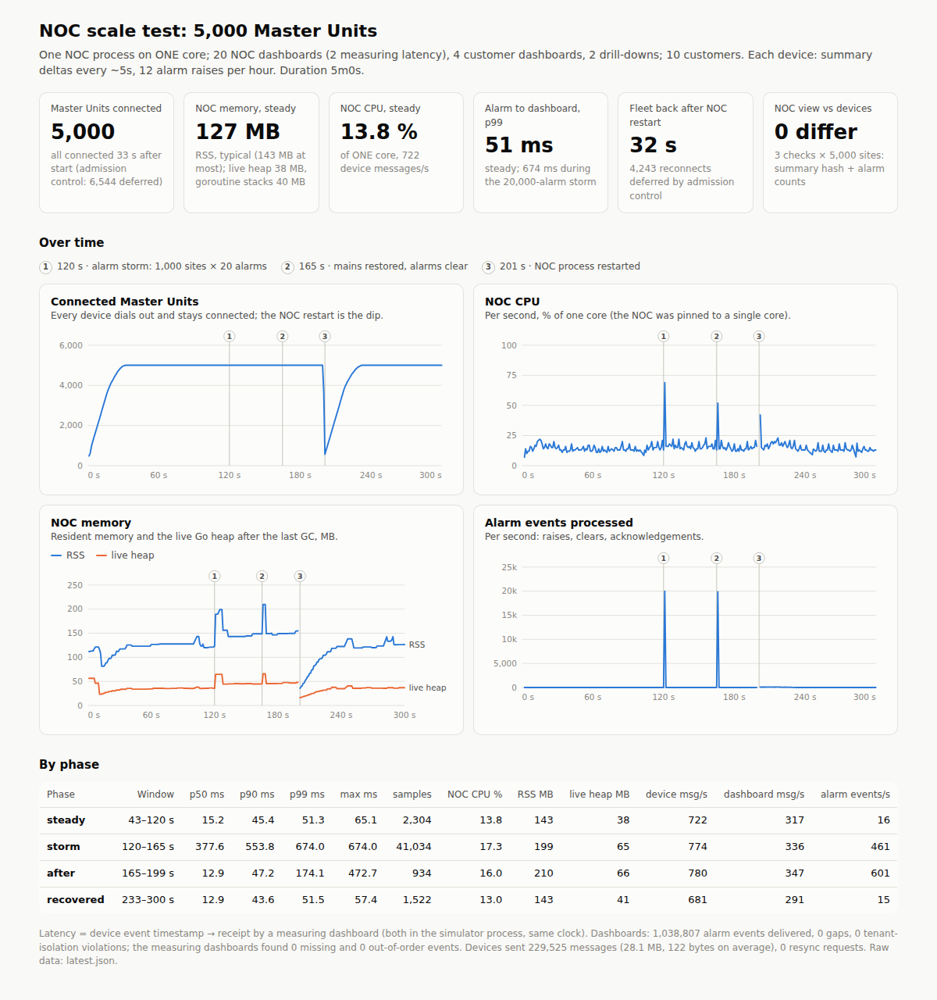

# Scale test

**Question:** can one NOC process, on one CPU core, carry a fleet of 5 000 Master Units
with live dashboards, survive an alarm storm and a restart, and still show exactly what
the devices report?

**Answer, measured:** yes, with room to spare. The same core carried 10 000 sites in
another run.



The interactive report is `bench/results/scale-report.html` (hover the charts; the table
holds the numbers). Raw data: `bench/results/latest.json` (5 000 sites, the reference run), an earlier
5 000-site run, and `bench/results/scale-10k-*.json` (10 000 sites).

## Method

`sh bench/scale.sh` (about 6 minutes) builds both binaries and runs:

- **The NOC**, pinned to CPU 0 with `taskset`, with a data directory, default settings
  (admission 200 handshakes/s, keep-alive 25 s, 50 ms alarm batching window).
- **`fleetsim`**, pinned to CPU 1: 5 000 simulated Master Units of 10 customers, each with
  120 to 480 Remote Nodes, a 5-second model step (summary deltas when something changed)
  and 12 spontaneous alarm raises per hour. Each device speaks das-noc.v1 over its own
  WebSocket, with the real reconnect logic (backoff with full jitter, `Retry-After`), the
  outbox and the detail stream.
- **26 dashboards** on the same WebSocket API as the NOC page: 20 NOC staff dashboards
  (overview + every alarm event; 2 of them decode every event to measure latency), 4
  customer dashboards (the simulator checks that they never receive another tenant's
  event), 2 drill-downs (one site's node table, streamed from the device).

Timeline: the fleet connects from cold; **steady state** from 10 s after the last site is
in; at **120 s a regional mains failure**: 1 000 sites raise 20 critical alarms each
(20 000 alarms within one model step); **45 s later mains is restored** and they clear; at
**200 s the NOC gets SIGTERM** and a new process starts on the same data directory; the
simulator measures how long the fleet takes to return. **Consistency checks** pause the
device models, wait 3 s, and compare every device's own summary hash and alarm counts with
what the NOC's REST API shows for that site.

**Alarm latency** is measured from the device's event timestamp to the moment a measuring
dashboard has received and decoded the event. Devices and dashboards live in the simulator
process, so both ends use the same clock. It includes the device's send, the NOC, the
batching window, and the dashboard side.

## Results: 5 000 sites (`bench/results/latest.json`)

| | |
|---|---|
| Fleet connected from cold | 33 s (admission control deferred 6 544 handshakes) |
| NOC CPU, steady | **13.8 % of one core** for 722 device messages/s and 317 dashboard messages/s |
| NOC memory, steady | **127 MB RSS** typical, 143 MB at most (during a consistency check); live heap 38 MB, goroutine stacks 40 MB, 5 058 goroutines |
| Alarm latency, steady | p50 **15 ms**, p99 **51 ms** (2 304 events measured) |
| Alarm storm, 20 000 alarms | p50 378 ms, p99 **674 ms**; NOC CPU 17.3 %, RSS 199 MB at most; 41 034 events measured |
| After the storm | p50 13 ms, p99 174 ms |
| NOC restart under load | the whole fleet back in **32.0 s** (4 243 reconnects deferred by admission control; 244 dials refused while no process listened) |
| After the restart | p50 13 ms, p99 52 ms; RSS 123 MB typical, 143 MB at most |
| Consistency | 3 checks × 5 000 sites (before the storm, 13 s after the fleet was back, at the end): **0 differences** |
| Dashboards | 1 038 807 alarm events delivered, **0 gaps**, **0 tenant-isolation violations**; the two measuring dashboards checked every event number: **0 missing, 0 out of order** |
| Device traffic | 229 525 messages, 28.1 MB in 5 minutes: 122 bytes per message, ~19 bytes/s per site |
| GC | stop-the-world pause p99 ≤ 0.20 ms over the whole run |

**Run-to-run variation.** An earlier run of the same test (`bench/results/scale-2026-09-27T09-21-26.json`,
same NOC hot path) measured 12.7 % CPU, p99 54 ms steady, **501 ms** during the storm, and
32.1 s for the restart. The storm tail is the least stable number; the others agree within
a few per cent.

## Results: 10 000 sites (same core, no restart phase)

| | |
|---|---|
| Fleet connected from cold | 58 s (200 handshakes/s by design; 26 746 deferred; 0 failures) |
| NOC CPU, steady | **22.0 % of one core** for 1 444 device messages/s |
| NOC memory, steady | **232 MB RSS** typical, 290 MB at most (consistency check); live heap 59 to 76 MB, stacks 79 MB |
| Alarm latency, steady | p50 25 ms, p99 53 ms |
| Alarm storm, 40 000 alarms (2 000 sites × 20) | p50 781 ms, p99 953 ms; NOC CPU 28.3 %; RSS 373 MB at most |
| Consistency | 2 checks × 10 000 sites: **0 differences** |
| Dashboards | 1 940 565 events, 0 gaps, 0 tenant-isolation violations |
| GC | stop-the-world pause p99 ≤ 0.33 ms |

During the 10 000-site storm the NOC used 28 % of its core, so it was not CPU-bound. The
simulator's core, which runs 10 000 device models and decodes every event for the two
measuring dashboards, is the likely bottleneck; it was not instrumented.

## What the numbers say

- **Cost per site:** about 20 KB of memory (a goroutine stack, socket buffers, the summary;
  127 MB at 5 000 sites, 232 MB at 10 000) and about 0.0025 % of a core in steady state.
  Memory is dominated by per-connection state, not by the data.
- **A restart is cheap.** 5 000 devices back in 32 s is admission control working as
  intended (200/s). Raise `-admit-rate` to shorten it; the NOC used 17 % of its core while
  re-admitting.
- **A storm is delivered in batches, not queued per event.** Dashboards receive it in
  batches of up to 500 events; no event was lost or reordered, and no dashboard fell behind
  the 50 000-event log. The storm latency (hundreds of ms) is the time to move 20 000
  events through the device models, the NOC and the measuring dashboards on two cores.
- **The GC is not a latency factor** for this workload: the worst stop-the-world pause
  percentile over all runs was 0.33 ms, against a 50 ms batching window.

## Caveats

- **One machine, loopback network.** No WAN latency, no packet loss, no TLS: in production
  TLS terminates at the ingress, whose cost is not measured here (5 000 idle TLS
  connections are ordinary for nginx or a cloud load balancer).
- **Simulated devices.** The protocol, reconnect and outbox logic are real; the Remote
  Node values are random walks. The real device side (`agent/noc-agent.js` against the
  das-01 Node.js backend with 300 simulated Remote Nodes) is tested by
  `scripts/agent-demo.sh`, one site at a time.
- **Two cores in total.** The simulator and the NOC each had one. On a larger machine the
  NOC would get more than one core (`GOMAXPROCS`); these numbers are for exactly one.
- **Five and four minutes.** Long-duration effects (heap fragmentation over weeks, slow
  leaks) need a soak test on real infrastructure.

## Reproducing

```sh
make scale                  # 5 000 sites, ~6 minutes, then the HTML report
SITES=10000 DURATION=240s STORM_AT=150s RESTART_AT=0 CHECKS=120s,230s sh bench/scale.sh
node bench/report.js        # bench/results/latest.json -> scale-report.html
```

It needs two cores and `ulimit -n` above the number of sites plus a few hundred: the NOC
and the simulator each hold one socket per site.
